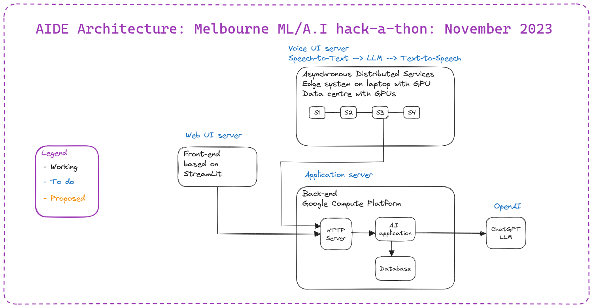
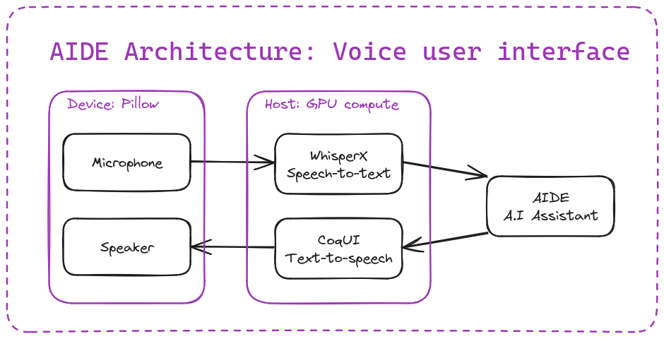

# AIDE: Aged care assistant and companion

**[Competition judge's guide is here](ReadMe.md) ☺**

## Technical documentation for developers

The AIDE system consists of three software servers that provide the
A.I assistant and companion back-end ... along with the Web and Voice
user interface front-ends.

- Application server
- Streamlit User Interface server
- Voice User Interface server

## Local installation and run the system

#### Prerequisites

- OpenAI API key: [See your OpenAPI account for acquiring an API key](https://platform.openai.com/api-keys)
- Recent version of Python 3.10.x (tested) or 3.11.x

### Local installation

The following installation commands have been tested on Linux and Mac OS X.

    git clone git@github.com:shaneantonio/aide-aiml.git
    cd aide-aiml
    python -m venv venv_aide
    source venv_aide/bin/activate
    pip install --upgrade pip
    pip install -r requirements.txt

Your Python virtual environment should now be ready to support the Application and Streamlit UI servers below.

### Run the Application server on your local system

The Application server is used by the Streamlit UI and Voice UI servers and must be running before any user interaction via the AIDE User Interfaces.

*Current working directory: Top-level of the aide-aiml repository*

    export OPENAI_API_KEY="sk-........"
    export OPENAI_TEMPERATURE=0.05  # Optional: Good for testing
    export DETERMINISTIC=True       # Optional: Good for testing
    python server/server.py
    # Running on http://127.0.0.1:8080  <-- REST API only, not HTML / HTTP

This server only provides a REST API endpoint for the AIDE User Interface servers.  It does not provide an HTML / HTTP endpoint for web browsers, instead have a look at the Streamlit UI server.

Note: It is entirely possible to develop a standard JavaScript / HTML / CSS web browser application that utilises this Application server.

### Run the Streamlit UI server on your local system

The Streamlit UI server provides standard web server (HTML / HTTP endpoint) that can be used by a web browser directly.

*Current working directory: Top-level of the aide-aiml repository*

    cd streamlit
    streamlit run home.py
    # You can now view your Streamlit app in your browser.
    # Local URL: http://localhost:8501  <-- Web browser host address (URL)

### Run the Streamlit UI server on Streamlit Community Cloud

- Fork the repo and sync any changes.
- Go to Strealit Community Cloud: https://streamlit.io/cloud
- Create a new app and link it to the forked repo
- Deploy the streamlit app

### Run the Voice User Interface server

The Voice UI server provides a conversation interface for non-technical users, especially the patient under care.

*** TBC: aiko_services sub-module ***

### Environment variable set-up (.env file)

Create a `.env` file with the following environment variables ...

    APPLICATION_SERVER='GCP' <-- Set as 'local' when testing connection to local server
    GCP_SERVER_URL="https://aide-server-ogdrzymura-km.a.run.app" <-- replace with your GCP URL
    LOCAL_SERVER_URL="http://127.0.0.1:8080" <-- replace with your local host server URL

Depending upon the changes made, you may need to redeploy your **application server** and/or **streamlit** server for those changes to take effect

## Cloud vendor (GCP) deployment and run the system

### Initial GCP environment set-up

    . set_env.sh
    gcloud config set project $PROJECT
    gcloud services enable \
        compute.googleapis.com \
        secretmanager.googleapis.com \
        artifactregistry.googleapis.com \
        cloudfunctions.googleapis.com \
        cloudscheduler.googleapis.com

### Create GCP secrets

Create GCP secret `OPENAI_API_KEY` and add IAM policy for service account access to the secret:

    OPENAI_API_KEY=<OPENAI_API_KEY>
    MAILGUN_API_KEY=<MAILGUN_API_KEY>
    . set_env.sh
    echo -n $OPENAI_API_KEY | gcloud secrets create OPENAI_API_KEY --project $PROJECT --data-file=-
    echo -n $MAILGUN_API_KEY | gcloud secrets create MAILGUN_API_KEY --project $PROJECT --data-file=-

    gcloud projects add-iam-policy-binding $PROJECT \
        --member=serviceAccount:${PROJECT_ID compute@developer.gserviceaccount.com \
        --role=roles/secretmanager.secretAccessor \
        --role=roles/iam.serviceAccountUser \
        --role=roles/storage.admin

    gcloud secrets add-iam-policy-binding OPENAI_API_KEY \
      --member="serviceAccount:${PROJECT_ID}-compute@developer.gserviceaccount.com \
      --role="roles/secretmanager.secretAccessor"

    gcloud secrets add-iam-policy-binding MAILGUN_API_KEY \
      --member="serviceAccount:${PROJECT_ID}-compute@developer.gserviceaccount.com \
      --role="roles/secretmanager.secretAccessor"

    gcloud iam service-accounts create ${SCHEDULER_SERVICE_ACCOUNT}

    gcloud projects add-iam-policy-binding ${PROJECT_ID} \
      --member="serviceAccount:${SCHEDULER_SERVICE_ACCOUNT}@${PROJECT}.iam.gserviceaccount.com" \
      --role="roles/run.invoker" \
      --role="roles/cloudscheduler.serviceAgent" \
      --role="roles/storage.admin"

    gcloud storage buckets create gs://$BUCKET_NAME --project ${PROJECT} \
        --location $FUNCTION_REGION --default-storage-class=STANDARD

### GCP scheduler

    gcloud scheduler jobs delete daily_notification-job --quiet --project $PROJECT --location $SCHEDULER_REGION

    gcloud scheduler jobs create http daily_notification-job \
      --project $PROJECT \
      --location $SCHEDULER_REGION \
      --schedule "$SCHEDULE" \
      --time-zone "Australia/Sydney" \
      --uri "$SCHEDULED_DAILY_NOTIFICATION_URI" \
      --http-method GET \
      --message-body '{"name": "Scheduler"}' \
      --oidc-service-account-email ${SCHEDULER_SERVICE_ACCOUNT}@${PROJECT}.iam.gserviceaccount.com

### Deploy application server to GCP and run

    ./server/deploy.sh

### GCP clean-up

    . set_env.sh
    gcloud run services delete aide-server --quiet --project $PROJECT --region=$REGION

## Build Docker image

    cd server
    docker build -f Dockerfile -t aide .
    docker run --rm aide
